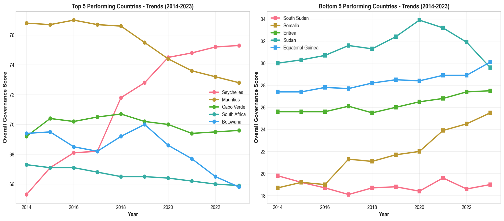

<div align="center">
  <strong></strong>

  # Ibrahim Index of African Governance (IIAG) - Comprehensive Analysis

   _By **BINATI AInalytics**_
</div>

## Demo 
See interactive [dashboard](https://htmlpreview.github.io/?https://github.com/CyprianFusi/Mo-Ibrahim-Index-African-Governance/blob/main/dashboard/index.html)





## 🎯 Project Overview

This project provides a comprehensive analysis of governance trends across 54 African countries from 2014 to 2023, using data from the **Mo Ibrahim Foundation's Ibrahim Index of African Governance (IIAG)**.

The analysis includes:
- ✅ **10 high-resolution static visualizations** (300 DPI, publication-ready)
- ✅ **8 interactive web-based charts** (HTML/Plotly)
- ✅ **Professional dashboard** for stakeholder presentations
- ✅ **Executive summary** with key insights
- ✅ **Presentation guide** for different audiences

---

## 📊 Quick Insights

### Top Performers (2023)
1. **Seychelles** (75.3) - 10-year leader
2. **Mauritius** (72.8) - Consistent top performer
3. **Cabo Verde** (69.6) - Island nation success

### Biggest Improvers (2014-2023)
1. **Seychelles** (+10.0 points)
2. **Gambia** (+7.2 points)
3. **Somalia** (+6.8 points)

### Regional Leaders
- **Southern Africa:** 54.6 average
- **North Africa:** 53.7 average
- **Continental Average:** 49.3

---

## 📁 Project Structure

```
analysis/
│
├── 📄 README.md                      # This file
├── 📄 ANALYSIS_SUMMARY.md            # Detailed executive summary
├── 📄 PRESENTATION_GUIDE.md          # Stakeholder presentation guide
│
├── 🐍 iiag_analysis.py               # Main analysis script (static viz)
├── 🐍 create_dashboard.py            # Dashboard generator (interactive)
│
├── 📊 visualizations/                # Static PNG charts (300 DPI)
│   ├── 01_governance_distribution.png
│   ├── 02_top_bottom_countries.png
│   ├── 03_temporal_trends.png
│   ├── 04_category_heatmap_top20.png
│   ├── 05_governance_change_all.png
│   ├── 06_regional_comparison.png
│   ├── 07_category_correlation.png
│   ├── 08_top_bottom_trends.png
│   ├── 09_radar_top5.png
│   └── 10_yoy_change_heatmap.png
│
├── 🌐 dashboard/                     # Interactive web dashboard
│   ├── index.html                    # 👈 MAIN DASHBOARD (open this!)
│   ├── interactive_map.html
│   ├── interactive_timeseries.html
│   ├── interactive_bar_top15.html
│   ├── interactive_radar.html
│   ├── interactive_heatmap.html
│   ├── interactive_scatter.html
│   ├── interactive_regional.html
│   └── interactive_boxplot.html
│
└── 📂 data/                          # Source data
    ├── csv-files/
    │   ├── 2024 IIAG_Composite Scores.csv
    │   ├── 2024 IIAG_Ranks.csv
    │   └── ...
    └── README 2024 IIAG_EN.txt
```

---

## 🚀 Getting Started

### 1. View the Interactive Dashboard (RECOMMENDED)

**No installation required!**

1. Navigate to `dashboard/` folder
2. Open `index.html` in any modern web browser
3. Interact with charts:
   - Hover for details
   - Zoom and pan
   - Click legend items

**Perfect for:**
- Presentations
- Board meetings
- Stakeholder briefings
- Remote screen sharing

---

### 2. View Static Visualizations

Navigate to `visualizations/` folder and open PNG files.

**Perfect for:**
- Reports (high-resolution, 300 DPI)
- Publications
- Email attachments
- Printed materials

---

### 3. Read the Analysis

Open `ANALYSIS_SUMMARY.md` for comprehensive insights including:
- Executive summary
- Key findings
- Temporal trends
- Regional analysis
- Policy recommendations

---

## 📋 What Each Visualization Shows

### Static Visualizations (PNG)

| File | Description | Best Use |
|------|-------------|----------|
| `01_governance_distribution.png` | Score distribution + regional box plots | Opening slide showing continental overview |
| `02_top_bottom_countries.png` | Top 15 & Bottom 15 countries | Establish performance hierarchy |
| `03_temporal_trends.png` | 10-year continental trends by category | Show long-term evolution |
| `04_category_heatmap_top20.png` | Multi-category performance matrix | Detailed analysis of top performers |
| `05_governance_change_all.png` | All countries' 10-year change | Identify improvers and decliners |
| `06_regional_comparison.png` | Regional performance across categories | Geographic pattern analysis |
| `07_category_correlation.png` | Category vs overall governance scatter | Evidence for policy interconnections |
| `08_top_bottom_trends.png` | Top 5 vs Bottom 5 temporal comparison | Divergence/convergence analysis |
| `09_radar_top5.png` | Subcategory radar for top countries | Strengths/weaknesses breakdown |
| `10_yoy_change_heatmap.png` | Year-over-year changes (Top 25) | Identify momentum and volatility |

### Interactive Dashboard Components

| Component | Interactivity | Insight |
|-----------|---------------|---------|
| **Africa Map** | Hover, zoom | Geographic distribution |
| **Time Series** | Multi-country selection | Temporal trends |
| **Bar Chart** | Sort, filter | Current rankings |
| **Radar Charts** | Compare top 5 | Category balance |
| **Heatmap** | Zoom, hover | Multi-dimensional view |
| **Scatter Plots** | Category correlations | Policy relationships |
| **Regional Bars** | Category comparison | Regional patterns |
| **Box Plots** | Distribution analysis | Variability assessment |

---

## 🎓 Key Findings Summary

### 1. **Island Nations Dominate**
Small island states (Seychelles, Mauritius, Cabo Verde) consistently outperform due to:
- Manageable governance scale
- Economic diversification (tourism, services)
- Political stability

### 2. **Reform Momentum**
Countries can improve significantly:
- **Gambia:** +7.2 (democratic transition)
- **Somalia:** +6.8 (post-conflict recovery)
- **Angola:** +5.8 (economic reforms)

### 3. **Democratic Backsliding**
Some previous strong performers declining:
- **Tunisia:** -4.7 (post-revolution challenges)
- **Mauritius:** -4.0 (economic pressures)
- **Botswana:** -3.6 (institutional erosion)

### 4. **Regional Disparities**
15-point gap between regions:
- **Southern Africa** leads (54.6)
- **Central Africa** struggles (39.7)

### 5. **Category Insights**
- **Human Development** scores highest (51.6 avg)
- **Security & Rule of Law** shows most variation (SD: 13.9)
- Strong correlations suggest integrated reform needed

---

## 🔧 Technical Details

### Dependencies

```python
# Core
pandas>=1.5.0
numpy>=1.24.0

# Visualization
matplotlib>=3.7.0
seaborn>=0.12.0
plotly>=5.14.0

# Optional
jupyter  # For notebook exploration
```

### Installation

```bash
pip install pandas numpy matplotlib seaborn plotly
```

### Running the Analysis

**Generate Static Visualizations:**
```bash
python iiag_analysis.py
```
Output: `visualizations/` folder with 10 PNG files

**Generate Interactive Dashboard:**
```bash
python create_dashboard.py
```
Output: `dashboard/` folder with HTML files

---

## 📊 Data Sources

**Primary Source:**
- **Mo Ibrahim Foundation**
- **Dataset:** Ibrahim Index of African Governance (IIAG) 2024
- **Website:** https://iiag.online
- **Coverage:** 54 African countries, 2014-2023

**Methodology:**
- **Scores:** 0-100 (100 = best governance)
- **Categories:** 4 main categories
- **Subcategories:** 16 detailed subcategories
- **Indicators:** 100+ underlying variables
- **Sources:** African Development Bank, World Bank, UN agencies, etc.

---

## 🎯 Use Cases

### For Policymakers
- Benchmark your country's performance
- Identify reform priorities
- Learn from top improvers
- Monitor temporal trends

### For Development Partners
- Target interventions
- Measure program impact
- Allocate resources strategically
- Design evidence-based programs

### For Investors
- Assess governance risk
- Identify stable markets
- Spot emerging opportunities
- Inform ESG decisions

### For Researchers
- Academic publications
- Comparative analysis
- Trend identification
- Hypothesis testing

### For Media
- Data journalism
- Infographics
- Country profiles
- Trend stories

---

## 📈 Presentation Tips

**For Different Audiences:**

1. **Executives (10 min):**
   - Start with `dashboard/index.html` → Africa map
   - Show top/bottom rankings
   - Highlight 2-3 key insights
   - End with recommendations

2. **Technical Stakeholders (30 min):**
   - Present full dashboard
   - Show correlation analysis
   - Discuss methodology
   - Allow for interactive Q&A

3. **Board/Government (15 min):**
   - Use `02_top_bottom_countries.png`
   - Show `03_temporal_trends.png`
   - Present `06_regional_comparison.png`
   - Focus on actionable insights

See `PRESENTATION_GUIDE.md` for detailed guidance.

---

## 📝 Customization

### Analyze Specific Country
```python
country_data = composite_scores[composite_scores['Country'] == 'Nigeria']
```

### Analyze Specific Region
```python
region_data = composite_scores[composite_scores['Region'] == 'West Africa']
```

### Custom Time Period
```python
recent_data = composite_scores[composite_scores['Year'] >= 2020]
```

### Export Specific Data
```python
top10 = latest_data.nlargest(10, 'OVERALL GOVERNANCE')
top10.to_csv('top_10_countries.csv', index=False)
```

---

## 🤝 Contributing

To extend this analysis:

1. **Add new visualizations:** Modify `iiag_analysis.py`
2. **Add dashboard components:** Modify `create_dashboard.py`
3. **Analyze new categories:** Use `data/csv-files/2024 IIAG_Scores.csv`
4. **Deep-dive analysis:** Create new Python scripts using existing templates

---

## 📚 Additional Resources

### Documentation
- `ANALYSIS_SUMMARY.md` - Full analytical report
- `PRESENTATION_GUIDE.md` - How to present to stakeholders
- `data/README 2024 IIAG_EN.txt` - Data documentation

### External Links
- [Mo Ibrahim Foundation](https://mo.ibrahim.foundation/)
- [IIAG Online Portal](https://iiag.online)
- [IIAG Methodology](https://iiag.online/about.html)

---

## ⚠️ Important Notes

### Data Integrity
- Missing values represented as NaN
- Some data points estimated (see source documentation)
- Confidence intervals available in source files

### Interpretation
- Scores are relative to African context
- Year-over-year changes may reflect methodology updates
- Country comparisons should consider context (size, resources, history)

### Updates
- IIAG released annually
- Scripts can be re-run with new data
- Visualization themes customizable

---

## 📞 Support

For questions about:
- **Data source:** Contact Mo Ibrahim Foundation
- **Methodology:** See IIAG documentation
- **Scripts/Analysis:** Review code comments
- **Custom analysis:** Modify Python scripts

---

## 📄 License

Data: © Mo Ibrahim Foundation (see their terms of use)
Analysis scripts: Open for educational and research purposes

---

## 🎉 Summary

This comprehensive analysis package provides everything needed to understand, present, and act on African governance data:

- ✅ **10 publication-ready charts** (300 DPI PNG)
- ✅ **Professional web dashboard** (Interactive HTML)
- ✅ **Executive summary** (Markdown)
- ✅ **Presentation guide** (Multi-audience)
- ✅ **Reproducible code** (Python scripts)
- ✅ **Source data** (CSV files)

**Next Steps:**
1. 📊 Open `dashboard/index.html` to explore
2. 📄 Read `ANALYSIS_SUMMARY.md` for insights
3. 🎤 Use `PRESENTATION_GUIDE.md` to prepare presentations
4. 🔧 Customize scripts for specific needs

---

**Questions?** Review the guides or explore the code - everything is documented and ready to use!

**Enjoy exploring Africa's governance landscape!** 🌍

**Analysis done by:**
Cyprian Fusi

https://binati-ai.com 


